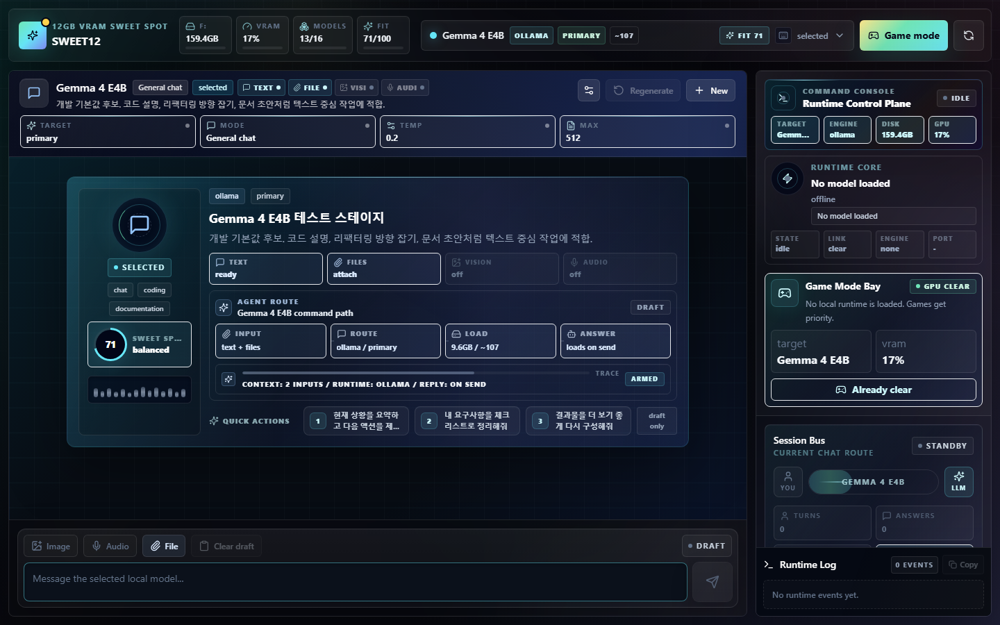
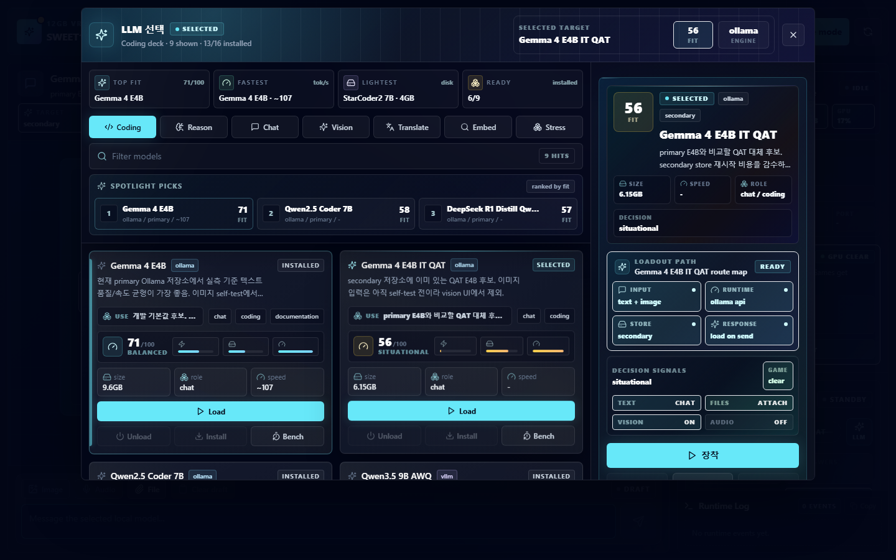
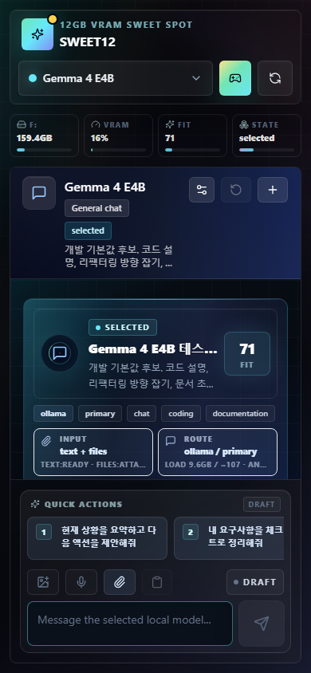

# SWEET12

12GB VRAM 환경에서 스윗하게 돌아가는 로컬 LLM 모음 런처 대시보드입니다.

Ollama/vLLM 후보 모델을 한 화면에서 고르고, 하나의 런타임만 장착해서 테스트 채팅을 돌리고, 게임할 때는 바로 언로드할 수 있게 만든 로컬 LLM 실험실입니다. 기본 목표는 RTX 4070 Ti 같은 12GB VRAM PC에서 “돌아가긴 하는 모델”이 아니라 실제 개발 작업에 기분 좋게 쓰는 스윗스팟을 찾는 것입니다.



## What It Does

- 역할별 모델 선택: coding, reasoning, chat, vision, translation, embedding, stress-test
- 한 번에 하나의 로컬 런타임만 활성화: 모델 교체 시 기존 런타임을 내리고 다음 모델을 올림
- Ollama primary/secondary store 스캔 및 설치 상태 표시
- vLLM 후보 모델 상태 표시와 별도 프로필 관리
- ChatGPT형 테스트 채팅: 스트리밍, regenerate, clear, system prompt, temperature, max tokens
- 멀티모달 모델용 입력 UI: image/audio/file 버튼과 모델 capability 표시
- 마크다운/GFM 렌더링: 표, 코드블록, 체크박스 목록
- Game mode: 로컬 LLM 런타임 언로드로 VRAM을 게임에 돌려줌
- F: 드라이브 여유 공간, VRAM, 설치 상태, 벤치 결과 표시

## Product Captures

### Model Selector



### Mobile



## Stack

- React + Vite + TypeScript
- Tailwind CSS + lucide-react
- Node/TypeScript Express API server
- Ollama local runtime
- vLLM OpenAI-compatible runtime profile for selected candidates
- Playwright smoke tests for desktop, laptop, mobile, markdown, attachment, streaming, runtime states

## Quick Start

Windows에서는 배치 파일을 실행하면 dev server를 띄우고 브라우저까지 엽니다.

```bat
Start SWEET12.bat
```

수동 실행:

```powershell
npm ci
npm run dev
```

브라우저:

```text
http://127.0.0.1:5173
```

API server 기본 포트:

```text
http://127.0.0.1:8788
```

## Validation

```powershell
npm run typecheck
npm run test:ui
npm run build
```

## Local Model Policy

모델 weight는 이 저장소에 포함하지 않습니다. 런처는 로컬 store를 스캔하고, 설치 가능한 모델은 UI에서 pull/download 작업으로 관리합니다.

기본 Ollama store 예시:

```powershell
F:\AI_Models\Ollama
F:\AI_Models\Gemma-4\.ollama-models
```

기본 런타임 정책:

- Ollama: `OLLAMA_MODELS=<store>`, `OLLAMA_HOST=127.0.0.1:11434`
- vLLM: `127.0.0.1:8080` OpenAI-compatible endpoint
- 모델은 한 번에 하나만 active
- 게임 전에는 Game mode로 런타임 언로드

## Sweet Spot Models

레지스트리는 [data/model-registry.json](data/model-registry.json)에 있습니다. 현재 구성은 Gemma 4 계열, Qwen coder/vision 계열, DeepSeek/StarCoder 후보, embedding/translation 모델을 역할별로 다룹니다.

벤치 요약은 [data/bench-results.json](data/bench-results.json)에 저장됩니다.
