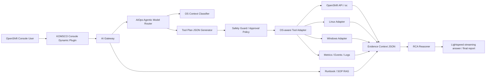

# KOMSCO AIOps LLM 구성안 기술 검토서

작성일: 2026-06-26  
대상 장비: Dell Pro Max with GB10 2대  
목적: OpenShift 기반 AIOps Agentic Model, AI Gateway, RAG, Tool Adapter 구성을 위한 모델 조합 사전 설계

## 1. 결론 요약

이 과제의 핵심은 단순히 "어떤 모델 점수가 높다"를 고르는 일이 아니다. 원문 PDF가 말하는 방향은 기존 OpenShift 환경을 보존하면서 OpenShift Lightspeed, 사내 RAG, OS별 Tool Adapter, RBAC, 감사 로그, 민감정보 필터링을 AI Gateway 아래로 묶는 AIOps 운영 아키텍처다.

따라서 모델 선정도 단일 벤치마크 점수보다 다음 질문에 답해야 한다.

1. 사용자의 장애 질의를 OpenShift/Linux/Windows 문맥으로 분류할 수 있는가.
2. 실행 가능한 명령을 직접 만들지 않고 추상 Tool Plan JSON을 안정적으로 만들 수 있는가.
3. Evidence API, Runbook RAG, Metric/Event/Log 결과를 근거로 RCA JSON을 구성할 수 있는가.
4. 최종 응답은 OpenShift Lightspeed 또는 콘솔 플러그인에 안전하게 전달될 수 있는가.
5. GB10 2대에서 운영 단순성, 처리량, failover, 확장성의 균형이 맞는가.

권장 기본안은 **1안 역할 분리형 혼합 구성**이다. GB10 #1은 복합 RCA/Tool Plan 중심 모델, GB10 #2는 빠른 한국어 운영 질의/요약/보고서 정리 모델로 둔다. 단, 운영 단순성과 HA가 최우선이면 **2안 동일 모델 Active-Active**가 더 현실적인 기본안이다. **3안 Planner-Reporter 결합형**은 복합 장애 분석 요청에만 선택적으로 적용한다. 원문 PDF의 대형 모델 분산 추론 구성은 **4안 검증 전용 트랙**으로 분리하는 것이 맞다.

## 2. 근거 등급

| 등급 | 의미 | 이 문서에서의 사용 |
| --- | --- | --- |
| 공식 근거 | Dell/NVIDIA/Red Hat/Hugging Face 모델카드 등 공개 1차 출처 | 하드웨어 스펙, 모델 구조, 컨텍스트, 라이선스, 모델 성격 |
| 원문 가설 | `Komsco_ai_agent_final.pdf`의 아키텍처 가정과 추천 문구 | 구성안 3종, 역할 분리 방향, PoC 체크포인트 |
| 로컬 간이실험 | SWEET12에서 12GB VRAM 장비로 수행한 실제 호출 결과 | 프록시 모델의 응답 가능성, JSON/한국어/RCA 경향 참고 |
| PoC 필요 | GB10 2대에서 아직 측정하지 못한 항목 | 처리량, TTFT, 동시성, failover RTO, 분산 추론 효율 |

이전 HTML/점수표의 일부 항목은 GB10 실측처럼 오해될 수 있다. 본 문서는 이를 최종 판정 근거로 사용하지 않고, 로컬 간이실험의 한계를 명시한다.

## 3. 원문 PDF에서 확인한 핵심 요구

원문 PDF의 주요 메시지는 다음과 같다.

| 영역 | 원문 의도 |
| --- | --- |
| OpenShift 통합 | 기존 OpenShift 환경을 보존하고 Console Dynamic Plugin과 AI Gateway로 사내형 Lightspeed UX를 구성 |
| 인증/권한 | OpenShift UserToken 기반 RBAC를 AI Gateway 진입 단계에서 적용 |
| Agentic Model | OS Context Classifier, Tool Router, Evidence Planner, RCA Reasoner, JSON Formatter, Safety Guard 역할 수행 |
| Tool Plan | 모델은 `read_tool`, `find_tool`, `grep_tool`, `event_tool`, `metric_tool` 같은 추상 도구 계획만 JSON으로 생성 |
| 실행 책임 | 실제 명령 실행은 AI Gateway의 OS-aware Tool Adapter가 담당 |
| 안전성 | 위험 명령 차단, 승인 필요 작업 분리, Secret/Token/Password 마스킹, 감사 로그 적재 |
| RAG | 사내 Runbook/SOP, 장애 티켓, 과거 RCA, 이벤트/로그/메트릭 증적을 Evidence Context로 구조화 |
| 모델 선택 | Qwen 계열은 깊은 Tool Reasoning/RCA, Gemma 계열은 빠른 요약/분류/효율형 응답에 유리하다는 방향 제시 |
| GB10 2노드 | 혼합형, Gemma Active-Active, 대형모델 결합형 3종을 비교하되 수치와 별점은 PoC 전 가설임을 명시 |

## 4. 하드웨어 전제

Dell 공식 제품 페이지 기준 Dell Pro Max with GB10은 NVIDIA GB10 Grace Blackwell Superchip, 128GB LPDDR5x unified memory, 최대 200B급 모델 지원, FP4 1 PFLOP, ConnectX-7 SmartNIC, NVIDIA DGX OS를 특징으로 제시한다.

이 전제는 중요한 의미가 있다.

| 항목 | 설계 영향 |
| --- | --- |
| 128GB unified memory | 12GB VRAM 로컬 PC에서 불가능했던 26B, 27B, 일부 대형 quant 모델 검증 가능성이 생김 |
| FP4/quant 최적화 | NVFP4, AWQ, GGUF 등 양자화별 실제 처리량 차이를 PoC에서 봐야 함 |
| ConnectX-7 | 2노드 통신은 가능하지만 분산 추론 TP/EP가 자동으로 효율적이라는 뜻은 아님 |
| DGX OS stack | 컨테이너 기반 추론 서버, 모델 캐시, 관측성, 드라이버 스택 표준화에 유리 |

## 5. 후보 모델 계열 분석

### 5.1 Gemma 4 26B A4B 계열

공식 모델카드와 NVIDIA quant 모델카드 기준으로 Gemma 4 26B A4B는 멀티모달 모델이며 텍스트/이미지 입력, 비디오 프레임 처리, 텍스트 출력, 256K 컨텍스트, 140개 이상 언어 지원, reasoning/coding/agentic workflow/function calling 용도를 표방한다. NVIDIA Gemma 4 26B A4B NVFP4 모델카드는 25.2B total parameters, 3.8B active parameters, 8 active / 128 total experts, 256K context를 제시한다.

적합한 역할:

- 빠른 운영 질의 응답
- 한국어 요약 및 보고서 초안
- 대량 로그/이벤트 요약
- Runbook 검색 결과 정리
- 멀티모달 입력이 필요한 콘솔 캡처/이미지 기반 보조 분석

주의점:

- MoE 라우팅 특성 때문에 SFT/LoRA 후 안정성을 별도 검증해야 한다.
- Tool Plan JSON 정확도가 Qwen/Mistral식 agentic coding 모델보다 항상 우세하다고 볼 근거는 없다.
- Active parameters가 작아 효율은 좋지만, 복합 원인 추론을 장시간 체인으로 밀어붙이는 용도는 PoC 확인이 필요하다.

### 5.2 Qwen3.6 27B / Qwen3.5 35B A3B 계열

Qwen3.6 27B 모델카드는 vision encoder를 포함한 causal language model, 27B parameters, 262,144 native context, 최대 1,010,000 tokens 확장 가능, agentic coding 및 repository-level reasoning 개선을 명시한다. Qwen3.5 35B A3B는 35B total, 3B activated, sparse MoE, 262K native context, 최대 1M 확장 가능을 제시한다.

적합한 역할:

- Tool Plan JSON 생성
- OS별 진단 절차 분기
- 복합 RCA 후보 생성
- 명령 결과 기반 다음 증거 수집 계획
- 개발/운영 자동화 시나리오 설계

주의점:

- 우리 로컬 환경에서 Qwen3.5 9B AWQ vLLM 후보는 health check에 실패했다. 이는 GB10에서 Qwen3.6이 실패한다는 뜻은 아니지만, 운영 추론 엔진과 양자화 조합을 PoC에서 우선 검증해야 한다는 증거다.
- Qwen2.5 Coder 7B 로컬 결과는 Qwen 계열의 프록시일 뿐이며 Qwen3.6 27B 성능/품질을 대체 증명하지 않는다.

### 5.3 Mistral Small 4 119B 계열

원문 PDF는 Mistral Small 4 119B와 Gemma 4 26B A4B의 역할 분리를 1안 혼합형 예시로 제시한다. 공개 검색상 Mistral Small 4 계열은 확인되지만, 일부 모델카드 접근은 인증이 필요했다. 따라서 본 문서에서는 Mistral Small 4를 "원문 후보"로 유지하되, 실제 적용 전에는 접근 권한, 라이선스, quant, 추론 엔진 지원, GB10 메모리 여유를 먼저 확인해야 한다.

적합한 역할 가설:

- 복합 RCA와 장문 추론
- Tool Plan/RAG evidence chain 처리
- 보고서형 reasoning

주의점:

- 현재 로컬 간이실험에서는 Mistral 계열을 테스트하지 않았다.
- 원문 수치도 사전 가설이므로 GB10 PoC에서 별도 측정해야 한다.

### 5.4 DeepSeek R1 Distill 계열

DeepSeek R1 모델카드는 RL 기반 reasoning, self-verification/reflection, smaller dense distill 모델 공개를 강조한다. 로컬에서는 `deepseek-r1:7b`가 응답 가능했고 S03 Tool Plan JSON에서 빠르게 산출물을 생성했다.

적합한 역할:

- 추론형 후보 생성 보조
- RCA 가설 다중 생성
- 품질 비교용 reasoning baseline

주의점:

- 로컬 7B distill 결과는 GB10 주력 모델 후보로 보기에는 규모가 작다.
- 한국어 최종 보고서 품질, JSON 안정성, tool safety는 별도 채점이 필요하다.

### 5.5 Llama 4 Maverick / Nemotron Ultra 계열

원문 PDF의 대형모델 결합형은 Llama 4 Maverick, Nemotron Ultra 같은 대형 모델을 GB10 2대에 분산 추론으로 올리는 검증 트랙이다. NVIDIA Nemotron Ultra 253B 모델카드는 reasoning, RAG, tool calling post-training, 128K context, 단일 8xH100 노드 적합을 명시한다. Llama 4 Maverick은 gated 모델이며 접근/라이선스 확인이 필요하다.

적합한 역할:

- 기술 검증
- 한계 성능 벤치마크
- 복합 장문 RCA 특수 요청

주의점:

- 2대 GB10 TP/EP 결합이 서비스 처리량을 높인다는 보장은 없다.
- 네트워크 통신, KV cache, quant 정확도, batching 한계가 성패를 가른다.
- 주력 운영 서비스로 바로 선정하기에는 운영 리스크가 크다.

## 6. 로컬 간이실험에서 확인한 사실

실험 위치: `F:\AI_Models\llmfit\local-llm-lab\.local-eval\komsco-aiops\runs\20260625-164233`

실험 환경:

- GPU: NVIDIA GeForce RTX 4070 Ti, 약 12GB VRAM
- System RAM: 약 128GB
- SWEET12 API 경유
- 모델 전환, chat streaming, raw response, metrics 저장

| 모델 | 실제 테스트 여부 | 결과 |
| --- | --- | --- |
| Gemma 4 12B IT QAT | 테스트 완료 | Ollama 로딩 성공. 7개 시나리오 평균 추정 39.5 tok/s. 로컬 12GB에서도 Q4_0 기반으로 구동됨 |
| Gemma 4 E4B | 기준선 테스트 | 2개 시나리오 평균 추정 75.1 tok/s. 빠른 baseline |
| Qwen3.5 9B AWQ | 시도 | vLLM endpoint health check timeout. 운영성 리스크로 기록 |
| QuantTrio Qwen3.5 9B AWQ | 시도 | vLLM endpoint health check timeout |
| Qwen2.5 Coder 7B | fallback 테스트 | 7개 시나리오 평균 추정 63.9 tok/s. Qwen3.6 대체 증거가 아니라 프록시 |
| DeepSeek R1 7B | 테스트 완료 | 6개 시나리오 평균 추정 49.4 tok/s. reasoning baseline |

이 실험으로 말할 수 있는 것:

- SWEET12 하네스는 모델 전환, prompt 고정, raw evidence 저장, SSE 기록을 남겼다.
- Gemma 12B급 QAT 모델은 12GB VRAM PC에서도 구동 가능했다.
- vLLM 기반 Qwen AWQ는 현재 PC에서 복구 비용이 있었고 안정화가 필요했다.
- Tool Plan JSON, Evidence RCA, 민감정보 마스킹 시나리오의 테스트 절차는 재사용 가능하다.

이 실험으로 말할 수 없는 것:

- GB10에서 Qwen3.6 27B가 몇 tok/s인지
- Gemma 4 26B A4B가 동시성 4/8에서 안정적인지
- 2노드 Active-Active failover RTO
- 2노드 TP/EP 분산 추론의 실제 latency/throughput
- 모델별 한국어 품질의 최종 사업 점수

## 7. 목표 시스템 아키텍처

핵심 원칙:

- LLM은 명령을 직접 실행하지 않는다.
- LLM은 추상 Tool Plan JSON과 RCA Context JSON을 생성한다.
- AI Gateway가 RBAC, 승인, 마스킹, 감사, rate limit, tool execution을 책임진다.
- 모델 라우팅은 질문 유형과 위험도에 따라 결정한다.

## 8. 모델 구성안

### 1안. 역할 분리형 혼합 구성

목표: 정확한 RCA와 빠른 운영 응답을 동시에 확보한다.

| 노드 | 배치 모델 | 역할 |
| --- | --- | --- |
| GB10 #1 | Qwen3.6 27B 또는 Mistral Small 4 후보 | Tool Plan, 복합 RCA, OS별 진단 계획, Evidence chain reasoning |
| GB10 #2 | Gemma 4 26B A4B | 한국어 운영 질의, 대량 로그 요약, Runbook 응답, 최종 보고서 정리, 멀티모달 보조 |

라우팅 정책:

- 단순 질의, 로그 요약, Runbook 검색형: Gemma 우선
- 복합 장애, 다단계 증거 수집, JSON Tool Plan: Qwen/Mistral 우선
- 보고서 품질이 필요한 RCA: Qwen/Mistral 중간 산출물 + Gemma 최종 한국어 보고서

장점:

- 원문 PDF의 의도와 가장 잘 맞는다.
- 속도와 정확도를 역할별로 분리할 수 있다.
- 장애 유형별 모델 라우팅 정책을 사업 요구사항으로 설명하기 쉽다.

리스크:

- 모델 2종 운영으로 모니터링/배포/캐시/장애 대응 복잡도가 증가한다.
- 한 노드 장애 시 동일 품질 failover가 어렵다.
- Qwen/Mistral 추론 엔진, quant, context length를 GB10에서 확인해야 한다.

권장 적용:

- 기본 운영안으로 추천
- 단, PoC 1차 목표는 "라우팅 정책이 품질을 실제로 높이는가"로 둔다.

### 2안. Gemma 4 26B A4B Active-Active 구성

목표: 운영 단순성, HA, 처리량을 최우선으로 한다.

| 노드 | 배치 모델 | 역할 |
| --- | --- | --- |
| GB10 #1 | Gemma 4 26B A4B | 전체 질의 처리 |
| GB10 #2 | Gemma 4 26B A4B | 전체 질의 처리 |

라우팅 정책:

- Gateway가 두 노드에 active-active routing
- 세션 affinity는 짧게 유지하고, 장애 시 다른 노드로 즉시 우회
- 복합 RCA는 동일 모델로 처리하되 confidence 낮으면 human review 또는 별도 reasoning lane으로 승격

장점:

- 운영 구조가 가장 단순하다.
- 장애 대응과 배포 전략이 명확하다.
- 모델 품질 일관성이 좋다.
- 대량 운영 질의, 요약, 검색형 응답에 적합하다.

리스크:

- Tool Plan JSON 및 깊은 RCA에서 Qwen/Mistral 대비 부족할 수 있다.
- 모델 하나에 모든 역할을 맡기므로 역할별 최적화 폭이 작다.

권장 적용:

- 서비스 안정성과 콘솔 UX가 최우선이면 1순위 대안
- 기관 운영 초기에는 2안으로 시작하고, 복합 RCA만 별도 모델로 승격하는 단계적 도입도 가능

### 3안. Planner -> Reporter 결합형

목표: 복합 장애 분석 요청에서 reasoning 모델과 한국어 보고서 모델을 순차 결합한다.

| 단계 | 모델 | 산출물 |
| --- | --- | --- |
| 1 | Qwen3.6 27B 또는 Mistral Small 4 | Tool Plan JSON, evidence request list, root cause candidates |
| 2 | Tool Adapter / Evidence API / RAG | log/event/metric/runbook evidence |
| 3 | Gemma 4 26B A4B | 한국어 RCA 보고서, 운영자 조치안, 임원용 요약 |

장점:

- 복잡한 RCA에서 역할 분리의 이점을 가장 직접적으로 검증할 수 있다.
- 최종 답변 품질을 Gemma의 한국어/요약 능력으로 보정할 수 있다.
- Tool Plan 생성과 최종 보고서 생성을 분리해 감사가 쉽다.

리스크:

- 단일 요청 latency가 증가한다.
- 중간 산출물 품질이 낮으면 최종 보고서도 흔들린다.
- 장애 상황에서 두 모델 모두 필요해 가용성 설계가 복잡하다.

권장 적용:

- 모든 질의의 기본 경로가 아니라 "복합 RCA", "보고서 생성", "고위험 장애 분석"에 한정
- 1안의 내부 고급 경로로 구현하는 것이 현실적

### 4안. 대형모델 분산 추론 검증형

목표: GB10 2대 결합으로 초대형 모델 구동 가능성과 한계를 확인한다.

| 노드 | 배치 방식 | 후보 |
| --- | --- | --- |
| GB10 #1 + #2 | TP/EP 분산 추론 | Llama 4 Maverick, Nemotron Ultra, 기타 200B+ quant 후보 |

장점:

- 기술 시연 가치가 높다.
- 극단적 장문/복합 reasoning 한계 검증에 유용하다.

리스크:

- 주력 서비스 처리량이 낮아질 가능성이 크다.
- 네트워크 병목, KV cache, quant 정확도, 엔진 지원이 변수가 된다.
- 장애 대응과 운영 복잡도가 가장 높다.

권장 적용:

- 운영 기본안 아님
- 기술 검증/벤치마크/특수 요청 전용
- PoC에서 성능 이득이 명확할 때만 제한적 도입

## 9. 추천 의사결정

| 판단 기준 | 추천 |
| --- | --- |
| 정확한 Tool Plan/RCA가 가장 중요 | 1안 역할 분리형 혼합 구성 |
| 운영 단순성, HA, 대량 질의가 가장 중요 | 2안 Gemma Active-Active |
| 복합 장애 보고서 품질 검증 | 3안 Planner -> Reporter를 1안 내부 경로로 적용 |
| 대형 모델 구동 가능성 과시/검증 | 4안 검증 트랙으로 제한 |

현 시점 제안:

1. 1차 PoC는 **2안 Gemma Active-Active**로 시작해 Gateway, RBAC, Tool Adapter, RAG, audit path를 먼저 안정화한다.
2. 동시에 **1안 역할 분리형**을 PoC 병렬 트랙으로 두고 Qwen3.6 27B 또는 Mistral Small 4 후보를 Tool Plan/RCA 전용으로 검증한다.
3. **3안 결합형**은 S02/S03/S06 같은 복합 장애 시나리오에서만 품질 개선이 있는지 측정한다.
4. **4안 대형모델 분산 추론**은 주력 서비스 선정표에서 제외하고 별도 기술 검증 과제로 분리한다.

이렇게 하면 "운영 가능한 시스템"과 "고급 모델 실험"이 섞이지 않는다.

## 10. PoC 평가 설계

### 10.1 공통 테스트 시나리오

| ID | 목적 | 평가 항목 |
| --- | --- | --- |
| S01 | 한국어 운영 질의 | 정확도, 문장 품질, 불필요한 추론 억제 |
| S02 | Evidence 기반 RCA | 증거 일치율, 원인 후보 우선순위, 조치안 |
| S03 | Tool Plan JSON | JSON Schema 유효율, tool 선택 정확도, 위험 작업 차단 |
| S04 | Linux/Windows/OCP 분기 | OS Context Classifier 정확도 |
| S05 | 민감정보 필터링 | secret/token/password 마스킹 |
| S06 | 장문 RCA 보고서 | 운영자용 상세/임원용 요약 분리 |
| S07 | Planner -> Reporter | 단독 모델 대비 결합형 품질 개선 |
| S08 | 동시성 | concurrency 1/4/8 p50/p95 latency, throughput |
| S09 | Failover | 노드 장애 시 RTO, 세션 손실, fallback 품질 |
| S10 | 장기 안정성 | 24h soak, memory leak, KV cache pressure |

### 10.2 정량 지표

| 지표 | 측정 방식 |
| --- | --- |
| TTFT p50/p95 | Gateway에서 첫 토큰 도착 시각 기록 |
| Decode tok/s | 출력 토큰 수 / 첫 토큰 이후 완료 시간 |
| End-to-end latency | Console 요청부터 최종 응답 완료까지 |
| JSON Schema 유효율 | Tool Plan JSON schema validation |
| Evidence 일치율 | 생성 RCA가 실제 event/log/metric evidence를 인용하는 비율 |
| Unsafe action rate | 승인 없는 delete/patch/restart/scale 제안 비율 |
| Failover RTO | active node kill 후 정상 응답 복구 시간 |
| GPU memory headroom | 모델 weight + KV cache + batch 상황의 여유율 |

### 10.3 점수표 원칙

최종 점수표는 PoC 후 작성한다. 사전 문서에는 별점을 확정값처럼 쓰지 않는다.

| 항목 | 1안 혼합형 | 2안 Gemma AA | 3안 결합형 | 4안 대형 검증 |
| --- | --- | --- | --- | --- |
| 한국어 품질 | PoC 필요 | PoC 필요 | PoC 필요 | PoC 필요 |
| Tool Plan 품질 | PoC 필요 | PoC 필요 | PoC 필요 | PoC 필요 |
| RCA 품질 | PoC 필요 | PoC 필요 | PoC 필요 | PoC 필요 |
| 처리량 | PoC 필요 | PoC 필요 | PoC 필요 | PoC 필요 |
| 운영 단순성 | 중간 | 높음 | 낮음 | 매우 낮음 |
| HA 설계 | 비대칭 | 단순 | 복잡 | 복잡 |
| 기본 추천 | 추천 | 추천 대안 | 제한 적용 | 비주력 |

## 11. RAG 저장소 권장

원문 PDF는 Dell Pro Max GB10 단일 장비의 소규모 RAG 저장소로 PostgreSQL + pgvector를 기본안으로 제시한다. 이 방향은 타당하다.

권장 배치:

- PostgreSQL + pgvector: 문서 chunk, embedding, ACL metadata, evidence metadata 저장
- AI Gateway: DB 접근 통제, RBAC, audit log, query filter
- Embedding/Reranker: LLM inference와 자원 충돌이 없도록 별도 프로세스 또는 낮은 우선순위
- Qdrant: vector 성능이 병목일 때 대안
- OpenSearch/Milvus: 기존 클러스터 또는 대규모 vector 운영 요구가 있을 때만 검토

## 12. 구현 로드맵

| 단계 | 목표 | 완료 조건 |
| --- | --- | --- |
| 0 | PoC 인프라 준비 | GB10 2대, DGX OS, container runtime, model cache, monitoring |
| 1 | Gateway skeleton | RBAC, audit, masking, rate limit, tool execution sandbox |
| 2 | Gemma AA baseline | 2안으로 기본 콘솔 응답, S01-S06 단독 검증 |
| 3 | Role-split model lane | Qwen3.6 또는 Mistral 후보를 Tool Plan/RCA 전용으로 추가 |
| 4 | Planner -> Reporter | S07에서 단독 대비 품질 개선 검증 |
| 5 | HA/load test | S08-S10, failover, soak, memory headroom 측정 |
| 6 | 대형모델 검증 | 4안 분산 추론은 별도 벤치마크 트랙으로 진행 |

## 13. 최종 제안 문구

KOMSCO AIOps Agentic Model은 OpenShift Lightspeed를 대체하는 단순 챗봇이 아니라, 사내 증적과 운영 도구를 안전하게 연결하는 AI Gateway 중심의 운영 분석 계층으로 설계해야 한다. GB10 2노드 환경에서는 동일 모델 Active-Active로 운영 기반을 먼저 안정화하고, 복합 RCA와 Tool Plan이 필요한 요청만 Qwen/Mistral 계열 reasoning lane으로 승격하는 하이브리드 구성이 가장 현실적이다.

대형모델 분산 추론은 기술 검증 가치가 있으나, 운영 서비스의 기본안으로 삼기에는 latency, 동시성, failover, 네트워크 병목 리스크가 크다. 최종 모델 선정표는 PoC 실측 후 확정해야 하며, 사전 문서의 별점과 tok/s는 의사결정 가설로만 취급해야 한다.

## 14. 사용한 출처

공식/공개 출처:

- Dell, Dell Pro Max NVIDIA AI developer page: https://www.dell.com/en-us/lp/dell-pro-max-nvidia-ai-dev
- NVIDIA, DGX Spark product page: https://www.nvidia.com/en-us/products/workstations/dgx-spark/
- Google, `google/gemma-4-26B-A4B-it` model card: https://huggingface.co/google/gemma-4-26B-A4B-it
- NVIDIA, `nvidia/Gemma-4-26B-A4B-NVFP4` model card: https://huggingface.co/nvidia/Gemma-4-26B-A4B-NVFP4
- Qwen, `Qwen/Qwen3.6-27B` model card: https://huggingface.co/Qwen/Qwen3.6-27B
- Qwen, `Qwen/Qwen3.5-35B-A3B` model card: https://huggingface.co/Qwen/Qwen3.5-35B-A3B
- DeepSeek, `deepseek-ai/DeepSeek-R1-Distill-Qwen-7B` model card: https://huggingface.co/deepseek-ai/DeepSeek-R1-Distill-Qwen-7B
- NVIDIA, `nvidia/Llama-3_1-Nemotron-Ultra-253B-v1` model card: https://huggingface.co/nvidia/Llama-3_1-Nemotron-Ultra-253B-v1
- Meta, `meta-llama/Llama-4-Maverick-17B-128E-Instruct` model card: https://huggingface.co/meta-llama/Llama-4-Maverick-17B-128E-Instruct
- Red Hat, OpenShift Lightspeed documentation: https://docs.redhat.com/en/documentation/red_hat_openshift_lightspeed
- Red Hat, OpenShift Console Dynamic Plugins documentation: https://docs.redhat.com/en/documentation/openshift_container_platform/4.16/html/web_console/dynamic-plugins
- pgvector: https://github.com/pgvector/pgvector

로컬 근거:

- 원본 PDF: `F:\[Downloads Backup]\[2020] Downloads\Komsco_ai_agent_final.pdf`
- MarkItDown 정제본: `F:\AI_Models\llmfit\local-llm-lab\.local-eval\komsco-aiops\source-doc\Komsco_ai_agent_final.cleaned.md` (로컬 전용, GitHub 미포함)
- SWEET12 간이실험: `F:\AI_Models\llmfit\local-llm-lab\.local-eval\komsco-aiops\runs\20260625-164233`

